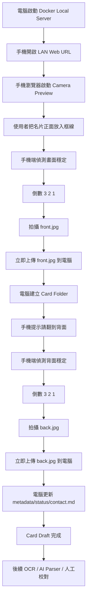

# Namecard Station 技術文檔

## 1. 專案定位

**Namecard Station** 是一個本地優先（local-first）的名片自動採集工具。

它讓使用者在電腦上啟動一個本地 Web Server，然後用手機瀏覽器開啟同一個區域網路內的拍攝頁面。手機端會啟動相機，偵測畫面穩定後自動倒數拍攝名片正面，提示使用者翻面，再自動倒數拍攝反面。拍攝完成後，圖片會立即上傳到電腦端，並以「每張名片一個資料夾」的方式保存。

本專案的核心不是 CRM，也不是重型 OCR 平台，而是：

```text
穩定採集名片正反面圖片
+
可靠保存原始資料
+
後續可逐步 OCR、AI 解析、校對與匯出
```

---

## 2. 主要目標

### 2.1 MVP 目標

第一版只解決一個問題：

> 把一堆紙本名片，透過手機自動拍攝正反面，安全保存到電腦資料夾中，方便之後整理。

MVP 必須完成：

* 電腦端可用 Docker 啟動本地服務
* 手機端可透過同一 Wi-Fi / LAN 開啟拍攝頁面
* 手機端可啟動 camera preview
* 手機端顯示名片對齊框
* 手機端自動偵測畫面穩定
* 穩定後自動倒數 `3、2、1`
* 自動拍攝正面
* 正面圖片立即上傳到電腦端
* 手機端提示翻到反面
* 穩定後自動倒數並拍攝反面
* 反面圖片立即上傳到電腦端
* 電腦端為每張名片建立獨立資料夾
* 保存 `front.jpg`、`back.jpg`、`metadata.json`、`status.json`、`contact.md`
* 電腦端提供簡單列表頁查看已保存的名片

### 2.2 非 MVP 目標

第一版不要做以下功能：

* 不做批量九宮格名片裁切
* 不做複雜 computer vision 邊界偵測
* 不做完整 CRM
* 不做登入系統
* 不做多人協作
* 不做雲端同步
* 不做 Google Contacts 同步
* 不做正式 SaaS billing
* 不強制做 OCR
* 不強制做 AI parser
* 不把資料庫當唯一資料來源

---

## 3. 推薦技術架構

### 3.1 技術選型

```text
Frontend:
- React
- TypeScript
- Vite
- PWA-ready

Backend:
- Node.js
- Fastify

Storage:
- Local filesystem
- 每張名片一個資料夾

Container:
- Docker
- Docker Compose

Database:
- MVP 不需要資料庫
- 第二階段可加入 SQLite 作為搜尋索引

OCR:
- MVP 不需要
- 第二階段可加入 Tesseract.js / Tesseract CLI
- 第三階段可加入 Google Vision OCR 或其他雲端 OCR

AI Parser:
- MVP 不需要
- 後續可選 OpenAI / Gemini / OpenRouter
```

### 3.2 架構原則

本專案採用以下原則：

1. **手機端負責拍攝決策**
   手機有鏡頭，也最接近畫面，因此手機端負責判斷畫面是否穩定、是否可以倒數、何時拍照。

2. **電腦端不處理 video stream**
   不把手機 video stream 傳到電腦端。這樣可以避免延遲、頻寬、同步、串流壓縮與 WebRTC 複雜度。

3. **電腦端只負責接收和保存**
   電腦端提供 API 接收圖片，建立資料夾，產生 metadata 與 markdown。

4. **圖片立即落盤**
   正面拍完後立即上傳保存。不要等正反面都完成才保存，避免中途斷線造成資料遺失。

5. **資料夾是 source of truth**
   SQLite 或其他資料庫只能作為索引，不作為唯一資料來源。即使資料庫壞掉，也可以從資料夾重新建立索引。

---

## 4. 系統流程



---

## 5. 手機端設計

### 5.1 角色定位

手機端是 **Camera Capture Controller**。

手機端負責：

* 開啟相機
* 顯示即時 preview
* 顯示名片對齊框
* 分析畫面亮度
* 分析畫面穩定度
* 分析框內是否有內容
* 自動倒數
* 從 video/canvas 擷取圖片
* 上傳圖片到電腦端
* 控制正面/反面流程

手機端不負責：

* 不保存永久資料
* 不處理 OCR
* 不處理 AI parser
* 不管理所有名片列表
* 不做資料庫操作

### 5.2 拍攝狀態機

手機端必須使用明確的 state machine，不要用混亂的 if/else 控制流程。

```ts
type CaptureState =
  | "idle"
  | "waiting_front"
  | "detecting_front"
  | "countdown_front"
  | "capturing_front"
  | "uploading_front"
  | "waiting_back"
  | "detecting_back"
  | "countdown_back"
  | "capturing_back"
  | "uploading_back"
  | "done"
  | "error";
```

### 5.3 狀態說明

#### `idle`

尚未開始拍攝。

使用者按下：

```text
Start Capture
```

後進入 `waiting_front`。

#### `waiting_front`

畫面提示：

```text
請把名片正面放入框線內
```

當 camera ready 後進入 `detecting_front`。

#### `detecting_front`

手機端持續分析畫面。

必須檢查：

* 亮度是否足夠
* 畫面是否穩定
* 框線內是否有足夠內容

若條件連續穩定，例如 800ms 至 1200ms，進入 `countdown_front`。

#### `countdown_front`

顯示：

```text
3
2
1
```

如果倒數期間畫面變得不穩定，取消倒數，回到 `detecting_front`。

倒數完成後進入 `capturing_front`。

#### `capturing_front`

從 video frame 擷取圖片。

建議做法：

* 使用 `<video>` 顯示 camera preview
* 使用 `<canvas>` 擷取當前畫面
* 儲存為 `Blob`
* 可根據固定名片框裁切圖片

完成後進入 `uploading_front`。

#### `uploading_front`

呼叫：

```http
POST /api/cards/:cardId/front
```

若尚未有 `cardId`，可先呼叫：

```http
POST /api/cards/start
```

上傳成功後進入 `waiting_back`。

#### `waiting_back`

畫面提示：

```text
正面已保存，請翻到背面
```

使用者翻面後，系統進入 `detecting_back`。

#### `detecting_back`

同 `detecting_front`，但目標是反面。

#### `countdown_back`

同 `countdown_front`。

#### `capturing_back`

同 `capturing_front`，但保存為 `back.jpg`。

#### `uploading_back`

呼叫：

```http
POST /api/cards/:cardId/back
```

上傳成功後呼叫：

```http
POST /api/cards/:cardId/complete
```

然後進入 `done`。

#### `done`

畫面提示：

```text
名片已保存
```

提供按鈕：

```text
拍下一張
查看資料夾
返回首頁
```

---

## 6. 自動拍攝判斷方法

MVP 不需要 AI，也不需要完整 computer vision。

只需要三個簡單檢查：

```text
Brightness Check
Motion Stability Check
Center Content Check
```

### 6.1 Brightness Check

從 canvas 擷取一個低解析度 frame，例如：

```text
160 x 120
```

計算平均亮度。

簡化公式：

```text
brightness = (r + g + b) / 3
```

判斷：

```text
太暗：brightness < 40
太亮：brightness > 230
合理：40 <= brightness <= 230
```

實際 threshold 可透過設定調整。

### 6.2 Motion Stability Check

比較目前 frame 和上一個 frame 的差異。

做法：

* 每 100ms 抽一幀
* 將 frame 縮小成低解析度
* 計算與上一幀的平均 pixel difference
* 若差異低於 threshold，視為穩定
* 連續穩定 N 次才允許倒數

概念：

```ts
function isFrameStable(current: ImageData, previous: ImageData): boolean {
  const diff = calculateAveragePixelDiff(current, previous);
  return diff < STABILITY_THRESHOLD;
}
```

建議：

```text
STABILITY_THRESHOLD = 8 ~ 15
requiredStableFrames = 8 ~ 12
sampleInterval = 100ms
```

也就是畫面穩定約 0.8 秒至 1.2 秒後才進入倒數。

### 6.3 Center Content Check

畫面中央顯示名片框，只分析框線內區域。

檢查框內是否有足夠對比。

目的不是完美判斷「這一定是名片」，而是避免在空桌面或模糊畫面時亂拍。

做法：

* 擷取名片框區域
* 計算亮度標準差或簡單 contrast
* contrast 達標才允許拍攝

概念：

```ts
function hasEnoughContent(frame: ImageData): boolean {
  const contrast = calculateContrast(frame);
  return contrast > CONTENT_THRESHOLD;
}
```

---

## 7. 名片框與裁切策略

MVP 不做自動偵測四角。

使用固定名片框：

```text
┌────────────────────────────┐
│                            │
│      請把名片放進框內        │
│                            │
└────────────────────────────┘
```

手機拍攝時：

* 使用者把名片放入框線
* 系統根據框線區域裁切圖片
* 儲存裁切後圖片

建議同時保存：

```text
front.original.jpg
front.jpg
back.original.jpg
back.jpg
```

如果 MVP 想更簡單，也可以只保存：

```text
front.jpg
back.jpg
```

但長期建議保存 original，避免裁切錯誤後無法恢復。

推薦資料夾：

```text
card-folder/
├── front.original.jpg
├── front.jpg
├── back.original.jpg
├── back.jpg
├── metadata.json
├── status.json
└── contact.md
```

---

## 8. 電腦端設計

### 8.1 角色定位

電腦端是 **Local Storage Server + Processing Station**。

電腦端負責：

* 提供手機拍攝頁面
* 提供圖片上傳 API
* 建立名片資料夾
* 保存圖片
* 產生 metadata/status/contact.md
* 顯示所有名片列表
* 後續 OCR / AI parser / export

電腦端不負責：

* 不處理 live video stream
* 不決定什麼時候拍照
* 不即時分析每一幀手機畫面

### 8.2 API 設計

#### Start Capture Session

```http
POST /api/cards/start
```

Response:

```json
{
  "cardId": "2026-05-24_230501_ab12",
  "folder": "data/cards/2026-05-24_230501_ab12"
}
```

Server 行為：

* 產生唯一 `cardId`
* 建立資料夾
* 建立 `metadata.json`
* 建立 `status.json`

#### Upload Front Image

```http
POST /api/cards/:cardId/front
Content-Type: multipart/form-data
```

Form field:

```text
file = front.jpg
```

Server 行為：

* 保存 `front.jpg`
* 如果有 original，可保存 `front.original.jpg`
* 更新 `status.json`

#### Upload Back Image

```http
POST /api/cards/:cardId/back
Content-Type: multipart/form-data
```

Form field:

```text
file = back.jpg
```

Server 行為：

* 保存 `back.jpg`
* 如果有 original，可保存 `back.original.jpg`
* 更新 `status.json`

#### Complete Card

```http
POST /api/cards/:cardId/complete
```

Server 行為：

* 檢查是否已有 front/back
* 產生或更新 `contact.md`
* 更新 `metadata.json`
* 更新 `status.json`

#### List Cards

```http
GET /api/cards
```

Response:

```json
{
  "cards": [
    {
      "id": "2026-05-24_230501_ab12",
      "created_at": "2026-05-24T23:05:01+08:00",
      "status": "captured",
      "has_front": true,
      "has_back": true
    }
  ]
}
```

#### Get Card Detail

```http
GET /api/cards/:cardId
```

Response:

```json
{
  "id": "2026-05-24_230501_ab12",
  "metadata": {},
  "status": {},
  "files": {
    "front": "/cards/2026-05-24_230501_ab12/front.jpg",
    "back": "/cards/2026-05-24_230501_ab12/back.jpg",
    "contact_md": "/cards/2026-05-24_230501_ab12/contact.md"
  }
}
```

---

## 9. 資料夾保存格式

### 9.1 根目錄

Docker volume 掛載：

```text
./data:/app/data
```

實際資料：

```text
data/
└── cards/
    └── 2026-05-24_230501_ab12/
        ├── front.original.jpg
        ├── front.jpg
        ├── back.original.jpg
        ├── back.jpg
        ├── metadata.json
        ├── status.json
        ├── ocr_raw.txt
        ├── contact.draft.json
        └── contact.md
```

### 9.2 metadata.json

```json
{
  "id": "2026-05-24_230501_ab12",
  "created_at": "2026-05-24T23:05:01+08:00",
  "updated_at": "2026-05-24T23:06:22+08:00",
  "source": "mobile-web-camera",
  "capture_mode": "auto-front-back",
  "app_version": "0.1.0",
  "device": {
    "user_agent": "",
    "screen_width": 0,
    "screen_height": 0
  },
  "files": {
    "front_original": "front.original.jpg",
    "front": "front.jpg",
    "back_original": "back.original.jpg",
    "back": "back.jpg"
  },
  "tags": [],
  "notes": ""
}
```

### 9.3 status.json

```json
{
  "capture": "done",
  "front": "done",
  "back": "done",
  "ocr": "pending",
  "ai_parse": "pending",
  "review": "pending",
  "export": "pending",
  "errors": []
}
```

如果只有正面：

```json
{
  "capture": "partial",
  "front": "done",
  "back": "pending",
  "ocr": "pending",
  "ai_parse": "pending",
  "review": "pending",
  "export": "pending",
  "errors": []
}
```

### 9.4 contact.draft.json

```json
{
  "name": "",
  "company": "",
  "job_title": "",
  "phone": [],
  "email": [],
  "website": [],
  "address": "",
  "social": [],
  "notes": "",
  "confidence": {
    "overall": 0,
    "name": 0,
    "company": 0,
    "phone": 0,
    "email": 0
  }
}
```

### 9.5 contact.md

```md
# Business Card Draft

## Status

- Capture: done
- OCR: pending
- AI Parse: pending
- Review: pending

## Images

- Front: `front.jpg`
- Back: `back.jpg`

## Extracted Contact

Name:  
Company:  
Job Title:  
Phone:  
Email:  
Website:  
Address:  

## OCR Raw Text

Pending.

## Notes


```

---

## 10. Docker 設計

### 10.1 docker-compose.yml

```yaml
services:
  namecard-station:
    build: .
    container_name: namecard-station
    ports:
      - "3000:3000"
    volumes:
      - ./data:/app/data
    environment:
      - NODE_ENV=production
      - PORT=3000
      - DATA_DIR=/app/data
```

### 10.2 重要要求

資料一定要透過 volume 掛載到 host：

```text
./data:/app/data
```

不要只存在 container 內部。

---

## 11. 專案目錄建議

```text
namecard-station/
├── apps/
│   ├── web/
│   │   ├── src/
│   │   │   ├── pages/
│   │   │   ├── components/
│   │   │   ├── hooks/
│   │   │   ├── lib/
│   │   │   └── types/
│   │   ├── index.html
│   │   └── package.json
│   │
│   └── server/
│       ├── src/
│       │   ├── routes/
│       │   ├── services/
│       │   ├── workers/
│       │   ├── storage/
│       │   └── index.ts
│       └── package.json
│
├── data/
│   └── cards/
│
├── docs/
│   ├── technical-spec.md
│   ├── api.md
│   └── roadmap.md
│
├── docker-compose.yml
├── Dockerfile
├── package.json
├── README.md
└── .gitignore
```

如果想簡化 monorepo，也可以第一版使用單一 app：

```text
namecard-station/
├── src/
│   ├── client/
│   └── server/
├── data/
├── docker-compose.yml
├── Dockerfile
└── package.json
```

MVP 可以先採用單一 app，避免過度工程化。

---

## 12. UI 頁面

### 12.1 Home Page

URL:

```text
/
```

功能：

* 顯示服務狀態
* 顯示電腦端 LAN URL
* 提供「Start Capture」入口
* 提供「Cards List」入口

### 12.2 Capture Page

URL:

```text
/capture
```

功能：

* 啟動手機相機
* 顯示 camera preview
* 顯示名片框
* 顯示當前狀態
* 自動偵測穩定
* 自動倒數拍照
* 上傳正面/反面

畫面狀態文字：

```text
請把名片正面放入框線
畫面太暗，請增加光線
請保持穩定
準備拍攝
3
2
1
正面已保存，請翻到背面
反面已保存
名片草稿已建立
```

### 12.3 Cards List Page

URL:

```text
/cards
```

功能：

* 列出所有 card folders
* 顯示建立時間
* 顯示狀態
* 顯示是否有 front/back
* 點擊進入 detail

### 12.4 Card Detail Page

URL:

```text
/cards/:cardId
```

功能：

* 顯示正面圖片
* 顯示反面圖片
* 顯示 contact.md
* 顯示 status
* 提供重新處理按鈕
* 後續可加入 OCR / review form

---

## 13. 後續 Worker 設計

MVP 可以先不做 worker。

第二階段加入 worker，負責掃描資料夾。

流程：

```text
每 10 秒掃描 data/cards/
找到 status.json 中 ocr = pending 的 folder
讀取 front.jpg/back.jpg
執行 OCR
寫入 ocr_raw.txt
更新 status.json
產生 contact.draft.json
更新 contact.md
```

Worker 可以是：

* Node.js interval worker
* CLI command
* 手動按鈕觸發

建議先做手動按鈕：

```text
Run OCR for this card
Run OCR for all pending cards
```

---

## 14. OCR 與 AI Parser Roadmap

### 14.1 MVP 0

無 OCR。

只保存圖片與 markdown。

### 14.2 MVP 1

加入本地 OCR：

* Tesseract.js
* Tesseract CLI

輸出：

```text
ocr_raw.txt
```

### 14.3 MVP 2

加入 AI parser。

Input:

```text
ocr_raw.txt
```

Output:

```text
contact.draft.json
contact.md
```

Parser 目標 JSON：

```json
{
  "name": "",
  "company": "",
  "job_title": "",
  "phone": [],
  "email": [],
  "website": [],
  "address": "",
  "social": [],
  "notes": ""
}
```

### 14.4 MVP 3

加入 Review UI。

使用者可在 Web UI 中校對欄位並保存。

### 14.5 MVP 4

加入匯出功能：

* CSV
* JSON
* vCard

---

## 15. 安全與網路注意事項

### 15.1 區域網路使用

預設只在 local network 使用。

Server listen：

```text
0.0.0.0:3000
```

手機訪問：

```text
http://<computer-lan-ip>:3000
```

例如：

```text
http://192.168.1.25:3000
```

### 15.2 Camera API 注意事項

手機瀏覽器 camera API 可能要求 secure context。

如果 `http://LAN-IP:3000` 無法啟動相機，可以提供以下方案：

1. 使用 localhost 測試桌面端 camera
2. 使用 mkcert 建立本地 HTTPS
3. 使用反向代理提供 HTTPS
4. 開發階段可先測試 Android Chrome 是否允許 LAN HTTP camera

MVP 文件需保留這個限制說明。

### 15.3 不建議第一版使用 Cloudflare Tunnel / ngrok

因為本專案目標是 local-first，不希望圖片經過外部通道。

除非使用者明確需要遠端訪問，否則不要預設開放到 public internet。

---

## 16. 錯誤處理

### 16.1 手機端錯誤

需要處理：

* Camera permission denied
* Camera not found
* Upload failed
* Network disconnected
* Server unavailable
* Countdown interrupted
* Image capture failed

### 16.2 電腦端錯誤

需要處理：

* Folder create failed
* File write failed
* Invalid cardId
* Missing front image
* Missing back image
* File too large
* Unsupported image type

### 16.3 Partial Capture

如果只拍到正面，系統也要保留資料夾。

狀態：

```json
{
  "capture": "partial",
  "front": "done",
  "back": "pending"
}
```

UI 應允許：

```text
Resume Back Capture
Retake Front
Delete Draft
```

---

## 17. Acceptance Criteria

### 17.1 Capture Flow

* 使用者可以從手機開啟 `/capture`
* 手機可以看到 camera preview
* 手機畫面有名片對齊框
* 畫面穩定後自動倒數
* 倒數期間如果畫面晃動，倒數會取消
* 正面拍攝後會立即上傳
* 上傳成功後電腦端資料夾中出現 `front.jpg`
* 手機提示翻面
* 反面拍攝後會立即上傳
* 上傳成功後電腦端資料夾中出現 `back.jpg`
* 完成後會產生 `metadata.json`、`status.json`、`contact.md`

### 17.2 Storage Flow

* 每張名片有獨立資料夾
* 資料夾名稱使用時間 + 隨機 ID
* Docker 重啟後資料仍存在
* 刪除 container 不會刪除 `./data`

### 17.3 List Flow

* `/cards` 可以列出已保存名片
* 每筆名片顯示建立時間與狀態
* 點擊可查看正反面圖片

---

## 18. GitHub Issue 拆分建議

### Issue 1: Project Bootstrap

建立 Node.js + Fastify + React + Vite 專案。

完成：

* Dockerfile
* docker-compose.yml
* `/health` endpoint
* 基本首頁

### Issue 2: Local File Storage Service

建立資料夾保存邏輯。

完成：

* `POST /api/cards/start`
* 建立 card folder
* 建立 metadata/status

### Issue 3: Image Upload API

完成圖片上傳。

完成：

* `POST /api/cards/:cardId/front`
* `POST /api/cards/:cardId/back`
* multipart upload
* 檔案寫入 local filesystem

### Issue 4: Mobile Capture Page

建立手機拍攝頁。

完成：

* camera preview
* 名片框線
* 手動拍攝按鈕
* 正反面流程

### Issue 5: Auto Capture Detection

加入自動拍攝。

完成：

* brightness check
* motion stability check
* center content check
* auto countdown
* countdown interrupt

### Issue 6: Card Complete Flow

完成 card draft 建立。

完成：

* `POST /api/cards/:cardId/complete`
* contact.md generation
* status update

### Issue 7: Cards List & Detail Page

完成管理頁。

完成：

* `/cards`
* `/cards/:cardId`
* 顯示 front/back
* 顯示 metadata/status

### Issue 8: Export Basic JSON/Markdown

完成基本匯出。

完成：

* 下載 contact.md
* 下載 metadata.json
* 下載整個 card folder 的 zip，optional

---

## 19. AI Coding Agent Prompt

以下 prompt 可直接給 AI coding agent 使用：

```text
You are building an open-source local-first web tool called Namecard Station.

Goal:
Create a Dockerized Node.js + Fastify + React + TypeScript + Vite app that allows a phone browser on the same LAN to auto-capture front and back images of a business card and save them to the computer filesystem as one folder per card.

Core architecture:
- Phone browser is the camera client.
- Phone decides when to capture by analyzing local video frames.
- Server does not receive or process live video stream.
- Server only receives uploaded images and writes files to local filesystem.
- Filesystem is the source of truth.
- Database is not required for MVP.

MVP features:
1. Docker Compose starts the local server on port 3000.
2. Web app provides /capture page for mobile camera capture.
3. Capture page uses getUserMedia to show camera preview.
4. Capture page shows a fixed business card guide frame.
5. Capture page runs simple checks: brightness, motion stability, center content contrast.
6. When stable, show 3-2-1 countdown and capture front image.
7. Upload front image immediately to server.
8. Prompt user to flip the card.
9. Repeat stable detection and countdown for back image.
10. Upload back image immediately to server.
11. Server creates one folder per card under ./data/cards/{cardId}/.
12. Server saves front.jpg, back.jpg, metadata.json, status.json, contact.md.
13. Web app provides /cards page to list saved card folders.
14. Web app provides /cards/:cardId page to view images and metadata.

Do not implement OCR, AI parser, login, CRM, cloud sync, or database in MVP.

Use clean TypeScript, clear state machine for capture flow, and simple filesystem services.
```

---

## 20. README 簡介草稿

```md
# Namecard Station

Namecard Station is a local-first web tool for automatically capturing front and back images of paper business cards using your phone browser, then saving each card as a recoverable folder on your computer.

It is designed for people who have many physical name cards but want a simple, private, and reliable way to digitize them before doing OCR, AI parsing, review, or export.

## Core Idea

- Your computer runs a local Docker server.
- Your phone opens the capture page through the same Wi-Fi/LAN.
- Your phone camera detects a stable card view.
- The app automatically counts down and captures the front side.
- You flip the card.
- The app automatically captures the back side.
- Images are uploaded and saved into a local folder.

## Why local-first?

The original card images are the most important source of truth. Namecard Station saves every card as files first, so your data can still be recovered even if a database or index breaks.

## MVP Scope

- Mobile camera capture
- Auto countdown capture
- Front/back card pairing
- Local filesystem storage
- Markdown/JSON draft generation
- Basic card list and detail page

## Not Included in MVP

- OCR
- AI parsing
- CRM
- Login
- Cloud sync
- Billing
- Database dependency
```

---

## 21. 最終技術決策

本專案第一版採用：

```text
React + TypeScript + Vite
Node.js + Fastify
Local filesystem
Docker Compose
No database for MVP
No OCR for MVP
No AI parser for MVP
```

核心決策：

```text
手機端決定什麼時候拍。
電腦端只負責接收和保存。
資料夾是唯一真相來源。
OCR 和 AI 都是後處理。
```

這樣可以讓第一版保持簡單、穩定、可開源、可離線，並且真正解決目前紙本名片整理的問題。
